<div align="center">

# 🕺 RobotDance

**Human Video → Humanoid Motion Compiler**

*人間の動画を、ヒューマノイドが学習・検索・模倣・実行できる運動へ変換する OSS コンパイラ。*

[**English**](README.md) · 日本語

[](https://github.com/rsasaki0109/RobotDance/actions/workflows/ci.yml)
[](LICENSE)


[](https://colab.research.google.com/github/rsasaki0109/RobotDance/blob/main/notebooks/quickstart.ipynb)

**[▶ Colab で今すぐ試す](https://colab.research.google.com/github/rsasaki0109/RobotDance/blob/main/notebooks/quickstart.ipynb)** — インストール不要・約2分で「1つの動き → 6体のヒューマノイド」。

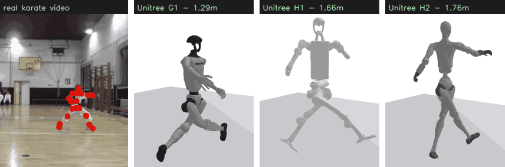

<sub><b>1つの動画 → 3体のヒューマノイド。</b> 左: 実際の空手動画（映像に 2D 骨格を重ね）→ Unitree <b>G1 (1.29m)</b>・<b>H1 (1.66m)</b>・<b>H2 (1.76m)</b> が、1本の単眼クリップから同じ型を同期再現。同じ動き・別体格の3体＝multi-embodiment retarget。（「Shorts to humanoid」の一行説明。）出典: Sdcsabac, CC BY-SA 4.0 (Wikimedia)、生動画は非再配布（レンダリングのみ）。</sub>

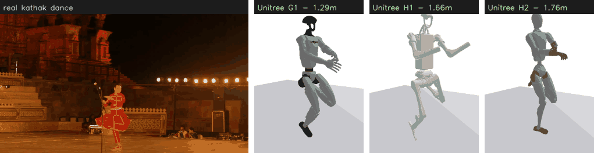

<sub><b>…空手だけじゃない。</b> 古典舞踊 <b>カタック</b>のクリップ → 同じ 3 体の Unitree が踊りを再現（actuator-IK 誤差 0.04〜0.12 m）。武術でも舞踊でも、単眼パイプラインは動作タイプを跨いで汎化する。出典: Suyash Dwivedi, CC BY-SA 4.0 (Wikimedia)、レンダリングのみ・生動画は非再配布。</sub>

### 🎬 色々な振付 × 3 機種

<table>
<tr>
<td align="center"><sub><b>G1</b><br>1.29m</sub></td>
<td align="center"><br><sub>groove</sub></td>
<td align="center"><br><sub>fast</sub></td>
<td align="center"><br><sub>wave</sub></td>
<td align="center"><br><sub>march</sub></td>
<td align="center"><br><sub>squat</sub></td>
</tr>
<tr>
<td align="center"><sub><b>H1</b><br>1.66m</sub></td>
<td align="center"><br><sub>groove</sub></td>
<td align="center"><br><sub>fast</sub></td>
<td align="center"><br><sub>wave</sub></td>
<td align="center"><br><sub>march</sub></td>
<td align="center"><br><sub>squat</sub></td>
</tr>
<tr>
<td align="center"><sub><b>H2</b><br>1.76m</sub></td>
<td align="center">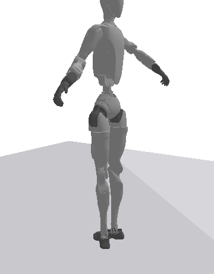<br><sub>groove</sub></td>
<td align="center">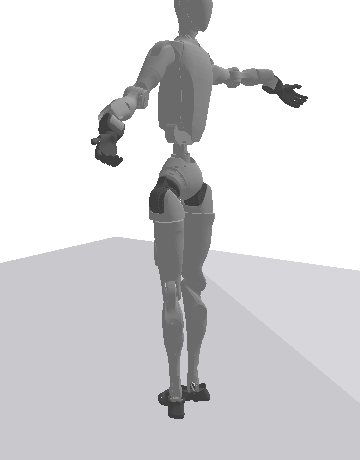<br><sub>fast</sub></td>
<td align="center">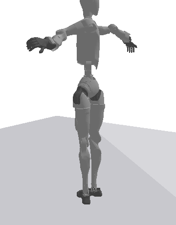<br><sub>wave</sub></td>
<td align="center">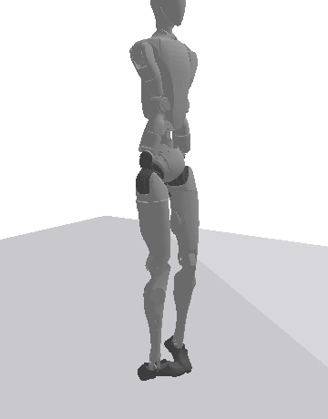<br><sub>march</sub></td>
<td align="center">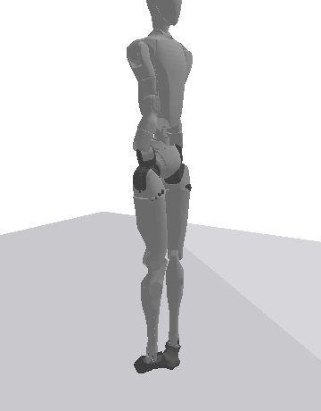<br><sub>squat</sub></td>
</tr>
</table>

<sub>同じ振付を実 G1 / H1 / H2 メッシュへ retarget。身長・DOF の違いがそのまま出る。<br>
※ メッシュ © Unitree Robotics（BSD-3-Clause, repo 非同梱）。GIF はパイプライン出力の可視化。</sub>

</div>

---

## これは何？

```
Input:  a short human video（合成 / 実動画(MediaPipe) / mocap(AMASS)）
Output: ロボット実行可能モーション + RD-MIR データセット + motion embedding
```

入力はすべて canonical **RD-MIR**（中核 motion IR）に合流し、**retarget → 物理検証 → embedding → ROS2 安全再生**へ流れます。

| ✅ RobotDance は | ❌ ではない |
| --- | --- |
| 動画 → ヒューマノイド運動資産の **motion compiler** | TikTok/Instagram scraper |
| **RD-MIR** を標準化するデータの OS | 単なる pose 推定ラッパー |
| G1/H1 を primary target にした **sim-first** 基盤 | 「動画→即実機が踊る」危険ツール |
| Isaac Lab 等に motion prior を供給する **frontend** | Isaac Lab / GR00T の competitor |

> ⚠️ v0 は pre-alpha・近似を含み**実機保証ではありません**（質量/慣性は実 URDF 由来だが balance/トルクは準静的近似）。境界は [`docs/SIM_TO_REAL.md`](docs/SIM_TO_REAL.md)。

## 実動画 → ヒューマノイド（本命 "Shorts to humanoid"）

ローカル動画を MediaPipe Pose で 3D 復元し、RD-MIR → retarget → 物理検証まで一気通貫。**① 骨格 overlay → ② canonical スケルトン → ③ 実 G1** の 3 段:

<table>
<tr>
<td align="center">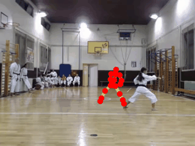<br><sub>① 原動画 + 骨格 overlay</sub></td>
<td align="center">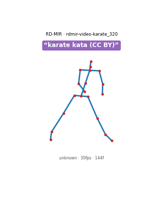<br><sub>② RD-MIR スケルトン</sub></td>
<td align="center">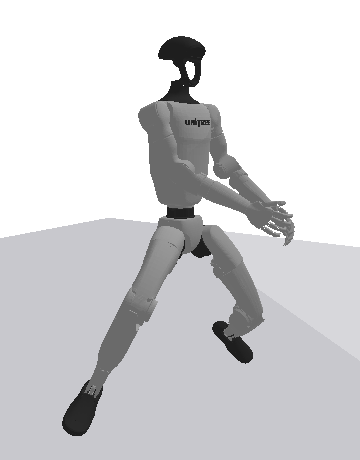<br><sub>③ 実 G1 が再現</sub></td>
</tr>
</table>

<sub>3 段は同一 extract から生成 — 前屈立ちと腕の技が overlay・復元スケルトン・ロボットで揃う。ロボットは各フレームで動的に接地（最下点を床へ）するので、骨盤固定で浮かず人間と一緒に屈伸・踏み込みする。actuator-IK リターゲットは**手先・足先を準剛体の肩・股より重く**重み付けするので、突き・蹴りが中腰に潰れず伸びる。さらに任意の**遮蔽ガード**（`retarget-ik --conf-gate`）が、単眼検出が落ちたフレーム（側面視の奥側の腕など）で手足の最後の高信頼方向を hold する。</sub>

**他の実クリップも → 実 G1 / H1:**

<table>
<tr>
<td align="center">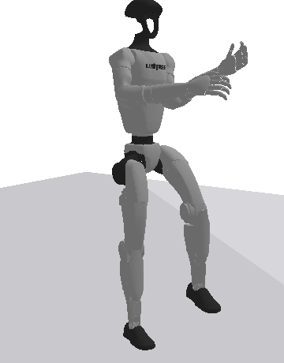<br><sub>squat → G1</sub></td>
<td align="center">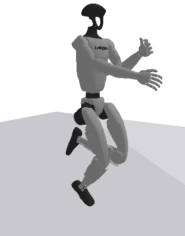<br><sub>kathak → G1</sub></td>
<td align="center">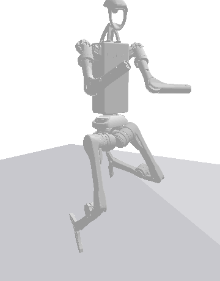<br><sub>kathak → H1</sub></td>
</tr>
</table>

<sub>※ **入力動画は repo に同梱しません。** overlay のみソース動画ピクセルを含む派生物（CC-BY 出典明記で可）、他は抽出 motion の可視化でピクセル非含有。Sources（Wikimedia Commons）: karate kata — Sdcsabac (CC BY-SA 4.0) / kathak — Suyash Dwivedi (CC BY-SA 4.0) / squat（上のクリップ）— Taco Fleur (CC BY-SA 4.0) / squat（下の検出器・物理デモ）— FitnessScape (CC BY 3.0)。生成は [`scripts/render_real_video_gif.py`](scripts/render_real_video_gif.py)。</sub>

### Pose 検出 — 色々な OSS 検出器を差し替え

抽出は差し替え可能なステージ。既定は MediaPipe Pose（retarget に要る **3D world landmarks** を返す）だが、各バックエンドは能力付きで登録され、`list-backends` で一覧、`pose-compare <clip>` で横並び比較、`extract --backend <name>` で選択できる。同一クリップに 3 つの OSS 2D 検出器を当て、COCO-17 に揃えた比較:


| backend | 検出率 | 平均 conf | ms/frame | 3D? |
| --- | --- | --- | --- | --- |
| MediaPipe (BlazePose) | 1.00 | 0.92 | 59 | ✅ world landmarks |
| YOLO11-pose (Ultralytics) | 1.00 | 0.78 | 38 | ❌ 2D のみ |
| RTMPose (rtmlib) | 1.00 | 0.72 | 201 | ❌ 2D のみ |

<sub>2D 検出器も `*+lift`（解析的 2D→正面平面 lift・深度なしの粗いベースライン）で実ロボットを駆動できる——YOLO11 のみの型で retarget IK 誤差 0.097m（native 0.071m）。完全な比較・指標・ロボットデモ: **[docs/POSE_BACKENDS.md](docs/POSE_BACKENDS.md)**。</sub>

### 物理検証が安全弁 — 無理な運動は止める

抽出した実 squat を feasibility certificate（実 URDF 慣性）にかけると **REJECT**。理由が診断的で「動画→即ロボット」を設計として防ぎます。`--ground-clean`（接地足を z=0 固定）で接地アーティファクトは消えるが、**残る balance は単眼の深度誤差律速**:

<table>
<tr><td>

| 軸 | 生抽出 | --ground-clean |
| --- | --- | --- |
| airborne | ⛔ 0.484 | ✅ **0.000** |
| torque | ✅ 0.878 | ✅ **0.615** |
| balance | ⛔ 0.601 | ⛔ **0.474** |
| **verdict** | REJECT | REJECT（balance 残） |

</td><td>


</td></tr>
</table>

<sub>残った ZMP のはみ出しは前後 x（単眼で最も不確実な深度）方向に偏る。完全 PASS には深度推定 / contact-aware retarget の改善が要る — v0 の正直な frontier。相補的な第一歩が 2 つ、いずれも観測できている横/高さ（y, z）を凍結し**未観測の前後 x だけ**を扱う: `extract --stabilize-depth`（抽出側 — 観測性で重み付けし、画像内で静的な関節の spurious な前後スプリットを抑える。例: shoulder press の静止脚 → ロボット足首スプリット 0.23→0.13 m）と `validate-sim --balance-refine`（retarget 側 — quasi-static balance prior, COM を支持多角形上へ）。ill-posed な軸の精緻化であり、violation を隠す平滑ではない。</sub>

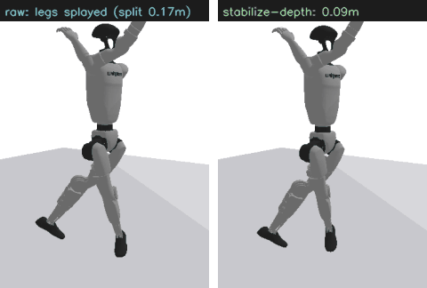

<sub><b><code>--stabilize-depth</code> の効果。</b> ショルダープレスのクリップ — 腕は動くが脚は静止なので単眼は深度の手がかりを得られず前後スプリットを幻視する（左、ロボットが開脚）。観測性ベースの深度安定化は脚が画像内で静的だと認識して前後位置を揃え、動いている腕はそのまま残す（右）。まさに以前は使えなかった種類のクリップ。出典: FitnessScape, CC BY 3.0 (Wikimedia)、レンダリングのみ。</sub>

### Benchmark — 各動作が PASS/REJECT する理由

`robotdance benchmark --chart` は motion スイート × ロボットを回し、各 run を **torque 比（×actuator 上限）** vs **balance 違反率** で散布図にする。動作が**どの軸で律速か**が一目で分かる:

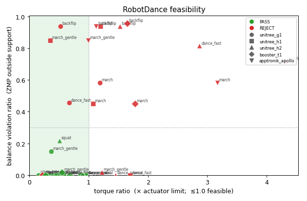

<sub>40 run（8 動作 × 5 機種）。PASS（緑）は実行可能領域（torque ≤ 1.0・balance 違反小）に集まる。失敗は原因で分かれ、`backflip`/`march` は**バランス律速**（上）、`dance_fast` は**トルク律速**（右）。マーカー=機種（G1/H1/H2/T1/Apollo）——同じ動作でも機種で可否が変わる。生成は `benchmark --chart`（MuJoCo）。motion 別/robot 別の表は `LEADERBOARD.md`。（Fourier N1 はこの物理プロットから除外——MJCF にトルク上限が無いため——だが下の幾何 reach 表には含む。）</sub>

**機種別の到達忠実度** — bone *方向* は全機種で保たれる（cos ≈ 1.0）が、身長正規化後の手先・足先**到達誤差**は機種で異なる。四肢比率が人間と違うため。物理を含まない純幾何指標なので `benchmark --no-sim` で全動作に対し算出される:

| robot | bone-dir cos | reach error（身長正規化） |
| --- | --- | --- |
| Fourier N1 | 1.00 | **0.075 m** |
| Booster T1 | 1.00 | 0.116 m |
| Unitree H2 | 1.00 | 0.117 m |
| Unitree G1 | 1.00 | 0.121 m |
| Apptronik Apollo | 1.00 | 0.139 m |
| Unitree H1 | 1.00 | **0.146 m** |

<sub>48 run（8 動作 × 6 機種）、`benchmark --no-sim`。方向忠実度だけだと「全機種完璧」に見えるが、reach error は cos が隠す四肢比率差を露わにする——H1 は四肢が長く最大、コンパクトな Fourier N1（人間に近い比率）が最小。上の物理 feasibility とは独立な、direction-preserving retarget の幾何的上限。</sub>

```bash
pip install -e ".[demo,sim,perception]"

robotdance video-to-robot my_clip.mp4 --robot unitree_g1 -o out.gif      # 動画→検証→side-by-side
robotdance extract my_clip.mp4 -o clip.rdmir.json                        # 動画→RD-MIR
robotdance motion-doctor clip.rdmir.json                                 # 健全性チェック(mirror/深度/接地)
robotdance overlay my_clip.mp4 clip.rdmir.json -o overlay.gif            # 骨格 overlay
robotdance validate-sim clip.rdmir.json --robot unitree_g1 --ground-clean --balance-plot b.png  # 物理検証
```

## Quick start（外部モデル・権利付き動画なしで試せる）

```bash
pip install -e ".[demo,sim]"

robotdance demo-multi  -o many_humanoids.gif --robots unitree_g1 unitree_h1  # 同一動作・多機種
robotdance demo-safety -o safety_check.gif --robot unitree_g1               # safe(PASS) vs backflip(REJECT)
robotdance synth -o dance.rdmir.json --duration 4                           # 合成 RD-MIR
robotdance validate-sim dance.rdmir.json --robot unitree_g1                 # 物理検証（executable: yes/no）
```

## できること

入力（合成 / 実動画 / mocap）→ RD-MIR → 以下のパイプライン。各 `command` の詳細は `--help` と各パッケージ README へ。

<details><summary><b>機能一覧（クリックで展開）</b></summary>

| 領域 | 主なコマンド |
| --- | --- |
| 抽出 | `extract`（`--backend`, `--stabilize-depth`）`import-hmr` `import-humanml3d` `import-babel` `import-motionx` `download-hf`（HF Hub 取得 → import-*、YouTube/TikTok の license-safe 代替）`smooth` `overlay` |
| pose backend & QC | `list-backends`（mediapipe / 2D+lift / gvhmr·wham）`pose-compare` `motion-doctor`（mirror/深度/接地） |
| データセット | `build-dataset`（RD-Manifest + license firewall / Data BOM）`dedupe-dir` |
| retarget | `retarget` `retarget-ik`（実 G1 23 関節角・end-effector 重み付け・`--conf-gate` 遮蔽ガード）`export-joints`（実機/シム SDK 向け関節角＋任意で `--with-velocity` 速度 CSV/JSON）`list-retargeters`（builtin / GMR）`demo-multi`（G1/H1/H2/T1/Apollo/N1） |
| 物理検証 | `validate-sim`（sim_certificate, MuJoCo）`--ground-clean` `--balance-refine` `--balance-plot` `sim-backends` |
| 埋め込み・検索 | `demo-motion-map` `train-encoder` `train-text-motion` `search-text` `search-motion`（`--text` ゼロ依存の概念検索, `--healthy-only` quality-aware） |
| 生成 | `train-tokenizer`（VQ-VAE）`train-prior` `demo-generate` `train-text2motion` `generate-text` `train-denoiser` |
| 学習 policy | `train-tracking`（PPO）`demo-track` `demo-track-multi` `export-policy`（RD-Policy + ONNX） |
| benchmark | `benchmark`（motion×robot leaderboard）`benchmark-extraction` |
| カード | `model-card` `cards-index`（lineage/license/failure/safety） |
| ROS2 runtime | `serve --ros2`（estop / pause / seek topics）`demo-runtime`（safety guard）`demo-joint-safety` |
| 統合 | `demo-pipeline`（RD-MIR→retarget→sim→policy→cards を 1 コマンド） |
| spec | `validate`（RD-MIR/Manifest/… の schema 検証）`specs`（spec 一覧＋version） |

</details>

<details><summary><b>埋め込み・検索・生成（画像つき）</b></summary>

**Motion Map** — RD-MIR を embedding 化し、類似検索・near-duplicate 除去・2D マップ:

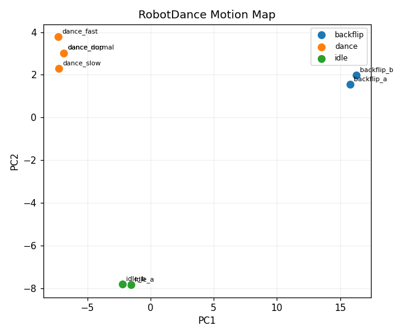

```bash
robotdance demo-motion-map -o motion_map.png
robotdance train-text-motion -o tm.pt && robotdance search-text "a backflip" --checkpoint tm.pt
# ゼロ依存のテキスト検索 — チェックポイント不要。各 motion の action_label と概念で照合
# （同義語・語形を畳む: "doing a somersault" → backflip, "upbeat dance" → energetic dance）:
robotdance search-motion ./corpus --text "doing a somersault" -k 3
robotdance generate-text "a person doing a backflip" -o bf.rdmir.json --gif bf.gif
```

生成物は schema 適合の RD-MIR なので、そのまま retarget → 物理検証 → ROS2 安全再生へ流せます。v0 は小さな合成 corpus・語彙限定で、**生成物は物理的に妥当とは限らない**（`validate-sim` で必ず検証）。

</details>

## 設計の柱

- **license-safe**: raw video/mocap/メッシュは**再配布しない**（URL/manifest + ローカル再構築）。`license_state=unknown` の派生 motion は firewall が公開を止める。SMPL は optional。
- **sim-first**: retarget した運動を MuJoCo 物理で feasibility 検証し、無理な運動は reject。実機 bridge は安全レビュー後。
- **ROS2 (Jazzy)**: certified な `.rdmotion` のみ safety guard 越しに配信（`/joint_states` で実 URDF を RViz 表示）。

| ライセンス対象 | 方針 |
| --- | --- |
| Code | Apache-2.0 |
| Schema / manifest | CC0 or Apache-2.0 |
| Model weights | open / research-only / 非配布に分離 |

## 対応ロボット

実 URDF/MJCF 由来の morphology（質量/慣性/可動域）で **Unitree G1・H1・H2 / Booster T1 / Apptronik Apollo / Fourier N1** に retarget + 物理検証。provenance は [`docs/EMBODIMENTS.md`](docs/EMBODIMENTS.md)。

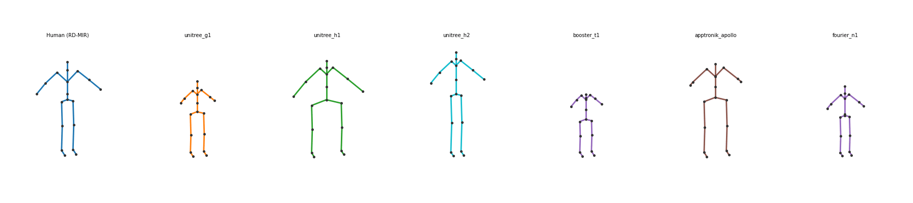

<sub>同一の canonical 動作を6機種すべてに retarget。四肢比率が異なる——H1/H2/Apollo は full-size、G1/T1/N1 はコンパクト——上の reach error 表が定量化したそのもの（N1 は人間に近い比率で誤差最小）。`demo-multi`（kinematic preview）。</sub>

## リポジトリ構成

```
specs/             仕様（RD-Manifest / RD-MIR / RD-Embodiment / RD-Motion / RD-Policy）
robotdance_core/        schemas, validators, CLI        robotdance_models/    tokenizer/encoder/policy
robotdance_data/        adapters, dataset, firewall     robotdance_ros2/      motion server, safety guard
robotdance_perception/  pose / HMR, smoothing           robotdance_unitree/   URDF map, SDK2/ROS2 bridge
robotdance_motion/      canonical, contacts, embeddings robotdance_benchmarks/ leaderboard
robotdance_retarget/    retargeting                     robotdance_viewer/    visualization
robotdance_sim/         MuJoCo / Isaac Lab backend
```

## ステータス

pre-alpha（最新版・全変更は [CHANGELOG](CHANGELOG.md)）。specs v0、抽出（MediaPipe/HMR）・データセット・埋め込み/生成・retarget（実 URDF）・MuJoCo 物理検証・RL tracking・ROS2 runtime・benchmark まで動作。ロードマップは [`docs/ROADMAP.md`](docs/ROADMAP.md)。

GMR・GVHMR/WHAM・H2O/OmniH2O・PHC・PHUMA など *人間動画→ヒューマノイド* 周辺の研究/OSS との関係と、RobotDance の差別化（license-safe な feasibility-gated コンパイラ）は [`docs/RELATED_WORK.md`](docs/RELATED_WORK.md) に整理。

## License

Code は [Apache-2.0](LICENSE)。データセット/モデルの利用許諾は source ごとに別途確認してください。
