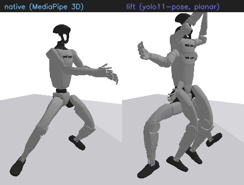

<div align="center">

# 🕺 RobotDance

**Human Video → Humanoid Motion Compiler**

*An OSS compiler that turns human videos into motion humanoids can learn, search, imitate, and execute.*

English · [**日本語**](README.ja.md)

[](https://github.com/rsasaki0109/RobotDance/actions/workflows/ci.yml)
[](LICENSE)


<sub>Human motion on the left (RD-MIR) → a real Unitree G1 dances the same choreography on the right. That's RobotDance in one line.</sub>

### 🎬 Many motions × two robots

<table>
<tr>
<td align="center"><sub><b>G1</b><br>1.29m</sub></td>
<td align="center"><br><sub>groove</sub></td>
<td align="center"><br><sub>fast</sub></td>
<td align="center"><br><sub>wave</sub></td>
<td align="center"><br><sub>march</sub></td>
<td align="center"><br><sub>squat</sub></td>
</tr>
<tr>
<td align="center"><sub><b>H1</b><br>1.66m</sub></td>
<td align="center"><br><sub>groove</sub></td>
<td align="center"><br><sub>fast</sub></td>
<td align="center"><br><sub>wave</sub></td>
<td align="center"><br><sub>march</sub></td>
<td align="center"><br><sub>squat</sub></td>
</tr>
</table>

<sub>The same choreography retargeted onto real G1 / H1 meshes — differences in height and DOF show through directly.<br>
※ Meshes © Unitree Robotics (BSD-3-Clause, not bundled in this repo). GIFs are visualizations of pipeline output.</sub>

</div>

---

## What is this?

```
Input:  a short human video (synthetic / real video (MediaPipe) / mocap (AMASS))
Output: robot-executable motion + RD-MIR dataset + motion embedding
```

Every input converges to the canonical **RD-MIR** (the core motion IR) and flows through **retarget → physics check → embedding → ROS2 safe playback**.

| ✅ RobotDance is | ❌ is not |
| --- | --- |
| a **motion compiler**: video → humanoid motion assets | a TikTok/Instagram scraper |
| a data OS that standardizes **RD-MIR** | just a pose-estimation wrapper |
| a **sim-first** stack targeting G1/H1 first | a "drop a video, robot dances now" toy |
| a **frontend** feeding motion priors to Isaac Lab etc. | a competitor to Isaac Lab / GR00T |

> ⚠️ v0 is pre-alpha and includes approximations — **not a guarantee on real hardware** (mass/inertia come from real URDFs, but balance/torque use a quasi-static approximation). The boundary is documented in [`docs/SIM_TO_REAL.md`](docs/SIM_TO_REAL.md).

## Real video → humanoid (the headline "Shorts to humanoid")

Recover 3D from a local video with MediaPipe Pose, then go end-to-end: RD-MIR → retarget → physics check. Three stages — **① skeleton overlay → ② canonical skeleton → ③ real G1**:

<table>
<tr>
<td align="center"><br><sub>① source video + skeleton overlay</sub></td>
<td align="center"><br><sub>② RD-MIR skeleton</sub></td>
<td align="center"><br><sub>③ real G1 reproduces it</sub></td>
</tr>
</table>

<sub>All three stages come from one extract — the forward stance and arm techniques line up across the overlay, the recovered skeleton, and the robot. The robot is dynamically grounded each frame (lowest point on the floor), so it bends and steps with the human instead of floating at a fixed pelvis height.</sub>

**More clips → real G1 / H1:**

<table>
<tr>
<td align="center"><br><sub>squat → G1</sub></td>
<td align="center"><br><sub>kathak → G1</sub></td>
<td align="center"><br><sub>kathak → H1</sub></td>
</tr>
</table>

<sub>※ **Source videos are not bundled in this repo.** Only the overlay is a derivative containing source pixels (allowed under CC-BY with attribution); the rest visualize the extracted motion and contain no source pixels. Sources (Wikimedia Commons): karate kata — Sdcsabac (CC BY-SA 4.0); kathak — Suyash Dwivedi (CC BY-SA 4.0); squat — FitnessScape (CC BY 3.0). Generated with [`scripts/render_real_video_gif.py`](scripts/render_real_video_gif.py).</sub>

### Pose detection — swap in different OSS detectors

MediaPipe Pose is the default (it returns **3D world landmarks** needed for retargeting), but extraction is a pluggable stage. Backends are registered with their capabilities — list them with `robotdance list-backends`, run a side-by-side comparison on your own clip with `robotdance pose-compare <clip> -o out.gif`, and pick one for extraction with `extract --backend <name>` (2D-only detectors are rejected for full extraction, which needs 3D). Here are three OSS 2D detectors on the same clip, all normalized to COCO-17 for a fair overlay:


| backend | det rate | mean conf | ms/frame | 3D? |
| --- | --- | --- | --- | --- |
| MediaPipe (BlazePose) | 1.00 | 0.92 | 59 | ✅ world landmarks |
| YOLO11-pose (Ultralytics) | 1.00 | 0.78 | 38 | ❌ 2D only |
| RTMPose (rtmlib) | 1.00 | 0.72 | 201 | ❌ 2D only |

<sub>On this clean single-person clip all three track well (YOLO11 is fastest). MediaPipe stays the default downstream because it also yields **3D world landmarks**; the 2D detectors would need a 2D→3D lifting stage to drive the robot. Generated with [`scripts/compare_pose_backends.py`](scripts/compare_pose_backends.py).</sub>

For the 2D detectors there is a `*+lift` backend (`yolo11-pose+lift`, `rtmpose+lift`) that embeds the COCO-17 pose into a **frontal plane** with an analytic anthropometric scale (`extract --backend yolo11-pose+lift`). It is a deliberately **coarse baseline** — it recovers *no depth*, so sagittal moves (squats) collapse while coronal moves (kata) survive. MediaPipe's native 3D stays the default; the lift exists to make the trade-off explicit and quantifiable.

Quantifying it on a kata clip — native MediaPipe 3D (blue) vs YOLO11→planar lift (red), same video:


| metric (147 frames, pelvis-centred) | value |
| --- | --- |
| native depth-x std | 0.175 m |
| lift depth-x std | **0.000 m** (planar by construction) |
| MPJPE native↔lift, full | 0.274 m |
| MPJPE native↔lift, frontal (y-z only) | 0.222 m |

<sub>The lift drops all forward/back motion (depth std → 0), which accounts for ~0.16 m of the 0.27 m gap; the rest is in-plane disagreement (different detector, no perspective/yaw model). Recognisable but coarse — exactly the honest trade-off. Generated with [`scripts/compare_lift_vs_native.py`](scripts/compare_lift_vs_native.py).</sub>

And it drives a real robot end-to-end — both paths retargeted onto the Unitree G1 mesh (left native, right lift-only):



<sub>A 2D detector alone (no native 3D) still produces a recognisable kata on the robot — retarget IK error 0.097 m vs 0.071 m for native, ~38 % worse. Good enough to prototype with a fast 2D model, with the depth cost made visible. Generated with [`scripts/render_lift_vs_native_robot.py`](scripts/render_lift_vs_native_robot.py).</sub>

### The physics check is the safety valve — it stops infeasible motion

Feed the extracted real squat into the feasibility certificate (real URDF inertia) and it **REJECTs**. The reasons are diagnostic, by design stopping "drop a video, robot dances now". `--ground-clean` (locking the contact foot to z=0) removes contact artifacts, but **the remaining balance is limited by monocular depth error**:

<table>
<tr><td>

| axis | raw extraction | --ground-clean |
| --- | --- | --- |
| airborne | ⛔ 0.484 | ✅ **0.000** |
| torque | ✅ 0.878 | ✅ **0.615** |
| balance | ⛔ 0.601 | ⛔ **0.474** |
| **verdict** | REJECT | REJECT (balance remains) |

</td><td>


</td></tr>
</table>

<sub>The residual ZMP excursion concentrates along the forward x axis (depth — the least reliable axis in monocular). A full PASS needs better depth estimation / contact-aware retargeting — v0's honest frontier.</sub>

```bash
pip install -e ".[demo,sim,perception]"

robotdance video-to-robot my_clip.mp4 --robot unitree_g1 -o out.gif      # video → check → side-by-side
robotdance extract my_clip.mp4 -o clip.rdmir.json                        # video → RD-MIR
robotdance overlay my_clip.mp4 clip.rdmir.json -o overlay.gif            # skeleton overlay
robotdance validate-sim clip.rdmir.json --robot unitree_g1 --ground-clean --balance-plot b.png  # physics check
```

## Quick start (no external models or licensed videos needed)

```bash
pip install -e ".[demo,sim]"

robotdance demo-multi  -o many_humanoids.gif --robots unitree_g1 unitree_h1  # same motion, many robots
robotdance demo-safety -o safety_check.gif --robot unitree_g1               # safe(PASS) vs backflip(REJECT)
robotdance synth -o dance.rdmir.json --duration 4                           # synthetic RD-MIR
robotdance validate-sim dance.rdmir.json --robot unitree_g1                 # physics check (executable: yes/no)
```

## What it can do

Inputs (synthetic / real video / mocap) → RD-MIR → the pipeline below. See `--help` and each package README for details on every `command`.

<details><summary><b>Feature list (click to expand)</b></summary>

| area | main commands |
| --- | --- |
| extraction | `extract` `import-hmr` `import-humanml3d` `import-babel` `import-motionx` `smooth` `overlay` |
| dataset | `build-dataset` (RD-Manifest + license firewall / Data BOM) `dedupe-dir` |
| retarget | `retarget` `retarget-ik` (real G1 23 joint angles) `demo-multi` (G1/H1/T1/Apollo) |
| physics check | `validate-sim` (sim_certificate, MuJoCo) `--ground-clean` `--balance-plot` `sim-backends` |
| embedding & search | `demo-motion-map` `train-encoder` `train-text-motion` `search-text` |
| generation | `train-tokenizer` (VQ-VAE) `train-prior` `demo-generate` `train-text2motion` `generate-text` `train-denoiser` |
| learned policy | `train-tracking` (PPO) `demo-track` `demo-track-multi` `export-policy` (RD-Policy + ONNX) |
| benchmark | `benchmark` (motion×robot leaderboard) `benchmark-extraction` |
| cards | `model-card` `cards-index` (lineage/license/failure/safety) |
| ROS2 runtime | `serve --ros2` `demo-runtime` (safety guard) `demo-joint-safety` |
| integration | `demo-pipeline` (RD-MIR→retarget→sim→policy→cards in one command) |

</details>

<details><summary><b>Embedding, search, generation (with images)</b></summary>

**Motion Map** — encode RD-MIR into embeddings for similarity search, near-duplicate removal, and a 2D map:


```bash
robotdance demo-motion-map -o motion_map.png
robotdance train-text-motion -o tm.pt && robotdance search-text "a backflip" --checkpoint tm.pt
robotdance generate-text "a person doing a backflip" -o bf.rdmir.json --gif bf.gif
```

Generated outputs are schema-conformant RD-MIR, so they flow straight into retarget → physics check → ROS2 safe playback. v0 uses a small synthetic corpus with a limited vocabulary, so **generated motion is not guaranteed physically valid** (always verify with `validate-sim`).

</details>

## Design pillars

- **license-safe**: raw video/mocap/meshes are **never redistributed** (URL/manifest + local rebuild). A firewall blocks publishing derived motion when `license_state=unknown`. SMPL is optional.
- **sim-first**: every retargeted motion is feasibility-checked in MuJoCo physics; infeasible motion is rejected. A real-hardware bridge comes only after safety review.
- **ROS2 (Jazzy)**: only certified `.rdmotion` is streamed through the safety guard (real URDF visualized in RViz via `/joint_states`).

| license target | policy |
| --- | --- |
| Code | Apache-2.0 |
| Schema / manifest | CC0 or Apache-2.0 |
| Model weights | split into open / research-only / non-distributed |

## Supported robots

Retarget + physics check onto **Unitree G1 · H1 / Booster T1 / Apptronik Apollo** with morphology (mass/inertia/joint limits) derived from real URDFs. Provenance in [`docs/EMBODIMENTS.md`](docs/EMBODIMENTS.md).

## Repository layout

```
specs/             specs (RD-Manifest / RD-MIR / RD-Embodiment / RD-Motion / RD-Policy)
robotdance_core/        schemas, validators, CLI        robotdance_models/    tokenizer/encoder/policy
robotdance_data/        adapters, dataset, firewall     robotdance_ros2/      motion server, safety guard
robotdance_perception/  pose / HMR, smoothing           robotdance_unitree/   URDF map, SDK2/ROS2 bridge
robotdance_motion/      canonical, contacts, embeddings robotdance_benchmarks/ leaderboard
robotdance_retarget/    retargeting                     robotdance_viewer/    visualization
robotdance_sim/         MuJoCo / Isaac Lab backend
```

## Status

pre-alpha (latest version and full changelog in [CHANGELOG](CHANGELOG.md)). Working: specs v0, extraction (MediaPipe/HMR), dataset, embedding/generation, retarget (real URDF), MuJoCo physics check, RL tracking, ROS2 runtime, and benchmark. Roadmap in [`docs/ROADMAP.md`](docs/ROADMAP.md).

## License

Code is [Apache-2.0](LICENSE). Verify dataset/model usage terms separately per source.
