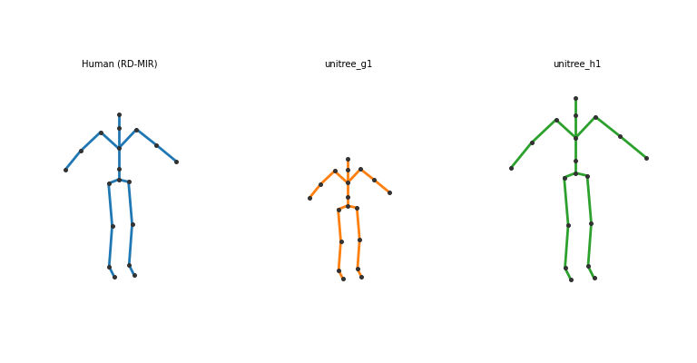
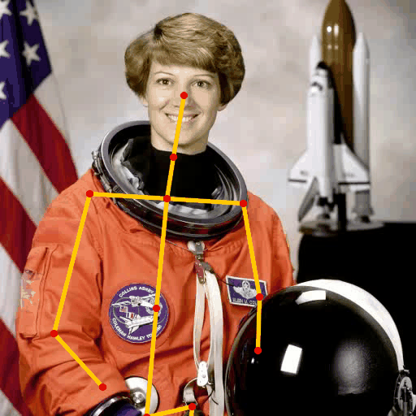
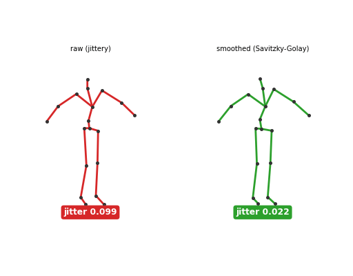
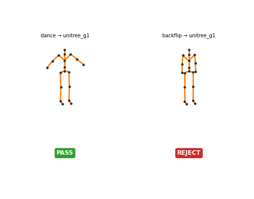

<div align="center">

# 🕺 RobotDance

**Drop a human motion video. Get a humanoid motion dataset, embedding, and G1 simulation replay.**

*RobotDance は、権利管理された人間動画を、ヒューマノイドロボットの運動データ・運動埋め込み・学習 policy・実行可能モーションへ変換する OSS モーションコンパイラです。*

[](https://github.com/rsasaki0109/RobotDance/actions/workflows/ci.yml)
[](LICENSE)




<sub>↑ **Same motion, many humanoids** — 1 つの人間モーション（RD-MIR）を Unitree G1（小型）と H1（full-size）へ
**kinematic retarget**。embodiment 非依存を一撃で示す。pose モデル・物理 sim 不要の運動学プレビュー。実 URDF / 物理検証は Phase 2。</sub>

</div>

---

## 一言で

> **RobotDance = "Human Video to Humanoid Motion Compiler"**

単なる pose estimation ラッパーでも、単なる retargeting ツールでも、単なる robot policy repo でもありません。
人間の全身運動を、ヒューマノイドロボットが**学習・検索・模倣・実行**できる形に変換する基盤です。

```
Input:  a short human video
Output: Unitree G1 simulation motion + RD-MIR dataset + motion embedding
```

## 今動くもの（v0, すべて検証済み）

| 機能 | コマンド | デモ |
| --- | --- | --- |
| 実動画 → 3D motion（MediaPipe） | `extract` / `video-to-robot` | bring your own video |
| mocap → motion（AMASS, skeleton-first） | `build-dataset` | + license firewall / Data BOM |
| G1 / H1 への retarget（multi-embodiment） | `retarget` / `demo-multi` | many humanoids ↑ |
| MuJoCo 物理検証（安全な運動だけ通す） | `validate-sim` / `demo-safety` | Demo 4: unsafe rejected |
| motion embeddings + 類似検索 + Motion Map | `demo-motion-map` | Demo 3 |
| temporal smoothing + 2D overlay | `smooth` / `overlay` | jitter 0.099→0.022 |
| benchmark（motion × robot leaderboard） | `benchmark` | CSV + leaderboard |
| ROS2 安全再生（Jazzy, safety guard） | `serve --ros2` / `demo-runtime` | RViz 可視化 |

> 入力は **合成 / 実動画(MediaPipe) / mocap(AMASS)** の 3 系統、すべて同じ canonical **RD-MIR** に合流し、
> retarget → 物理検証 → embedding → 安全再生のパイプラインを流れます。
> ⚠️ v0 は近似プロキシ・近似質量で**実機保証ではありません**（各パッケージ README 参照）。

## What RobotDance is / is not

| ✅ RobotDance は | ❌ RobotDance ではない |
| --- | --- |
| 人間動画 → ヒューマノイド運動資産の **motion compiler** | TikTok/Instagram scraper |
| **Motion IR (RD-MIR)** を標準化するデータの OS | 単なる pose estimation ラッパー |
| Unitree G1/H1 を primary target にした **sim-first** 基盤 | 「動画を入れたら即実機が踊る」危険ツール |
| Isaac Lab 等に motion prior を供給する **frontend** | Isaac Lab / GR00T の competitor |
| ダンスは強いデモの一つ（対象はスポーツ・武道・日常動作・リハビリ等） | ダンス専用ツール |

## 4 つの出力

1. **Humanoid Motion Dataset** — ライセンス管理済みの全身運動データセット
2. **Motion Embeddings** — 検索・クラスタリング・VLA 接続・RL conditioning 用の運動表現
3. **Robot Policies** — G1/H1 が物理的に追従できる policy
4. **Robot Executable Motions** — ROS2 / Unitree SDK / sim runtime で再生可能な artifact

## アーキテクチャ

```
[Video Source]            ローカル / 許諾済み / URL manifest
      ↓
[Source Manifest Layer]   RD-Manifest: URL, license, provenance, rebuild recipe
      ↓
[Video Processing]        decode, segmentation, tracking, quality scoring
      ↓
[Human Motion Recovery]   2D pose → 3D pose / SMPL / world-grounded motion
      ↓
[RD-MIR]  ◀── 中核標準 ──  canonical skeleton, root trajectory, contacts, metadata
      ↓
[Motion Understanding]    embeddings, action tags, retrieval, quality classifier
      ↓
[Retargeting]             canonical human motion → robot embodiment motion
      ↓
[Physics Validation]      kinematic / contact / sim tracking, fall / torque / slip
      ↓
[Learning]                motion encoder, foundation model, RL tracker
      ↓
[Runtime]                 ROS2 / Unitree SDK2 / simulation / motion server
```

中核となる内部標準は **RD-MIR (RobotDance Motion Intermediate Representation)** です。詳細は [`specs/`](specs/) を参照。

## Real video → humanoid（bring your own video）

本命の **"Shorts to humanoid"**。ローカル動画を MediaPipe Pose で 3D 復元し、canonical RD-MIR →
G1/H1 retarget → MuJoCo 物理検証まで一気通貫します。

```bash
pip install -e ".[demo,sim,perception]"

# 動画 → RD-MIR → retarget → 物理検証 → human|robot side-by-side
robotdance video-to-robot my_clip.mp4 --robot unitree_g1 -o shorts_to_humanoid.gif

# 抽出（Savitzky-Golay 平滑化込み）/ 原動画への骨格オーバーレイ
robotdance extract my_clip.mp4 -o clip.rdmir.json
robotdance overlay my_clip.mp4 clip.rdmir.json -o overlay.gif
```

**実ピクセルでの検出（公有データで検証）** — 抽出した 2D 骨格を原フレームに重ねて目視確認できます:



<sub>骨格 overlay（黄=bone, 赤=joint）。画像は scikit-image の `astronaut`（NASA 撮影, public domain = Tier A）。
上半身は高 confidence、ポートレートなので下半身は外挿。実動画では全身が取れる。</sub>

**temporal smoothing** — monocular pose は jittery なので Savitzky-Golay で平滑化（`extract` は既定で適用）:



<sub>左: raw（赤, jittery）/ 右: smoothed（緑）。jitter（フレーム間加速度）0.099 → 0.022。</sub>

> ⚠️ **実動画は同梱しません。** 入力動画の権利はユーザー責任で、アダプタは動画を再配布せず、
> 抽出 RD-MIR の `license_state` は `"unknown"`（source 未確認 → 派生 motion を公開しない）。
> 検証は landmark→canonical マッピングの単体テストと、公有 `astronaut` 実写での検出テストで行っています
> （[`robotdance_perception`](robotdance_perception/) / [`robotdance_motion`](robotdance_motion/)）。

## ROS2 runtime — 安全ゲート越しの motion server（Jazzy）

certified な `.rdmotion` を **Safety Guard**（§5.6）越しに ROS2 へ配信します。`sim_certificate` が
無い / REJECT の motion は**再生前に遮断**します（「動画を入れたら即ロボットが踊る」を防ぐ）。

```bash
robotdance demo-runtime          # certificate PASS → 再生 / REJECT → 遮断（ABORT）
robotdance serve g1.rdmotion.json --ros2   # ROS2 配信（RViz で skeleton 可視化）
```
```
dance(PASS)      cert=PASS   → motion_server: 再生（120 frames）
backflip(REJECT) cert=REJECT → motion_server: 遮断（ABORT）（0 frames）
```

- core（safety guard / motion server）は **ROS2 非依存で完全テスト可能**。ノードは **ROS2 Jazzy**（primary target）。
- topic: `/robotdance/skeleton`（MarkerArray, RViz）、`/robotdance/safety`、`/robotdance/estop`。
- **sim-first** — 実機 bridge は安全レビュー後（[`robotdance_ros2`](robotdance_ros2/)）。

## Benchmark — motion × robot leaderboard

全指標（retarget / sim_certificate / source 品質）を **motion × robot** で集計し、CSV + leaderboard を出力します。

```bash
robotdance benchmark --robots unitree_g1 unitree_h1 -o out/
```

サンプル結果（合成スイート 4 motion × G1/H1、[全文](docs/benchmark/LEADERBOARD.md)）:

| robot | runs | PASS率 | 平均 bone方向cos | 平均 foot_sliding |
| --- | --- | --- | --- | --- |
| unitree_g1 | 4 | 0.75 | 1.000 | 0.024 |
| unitree_h1 | 4 | 0.50 | 1.000 | 0.034 |

<sub>backflip は両機で REJECT。fast dance は背の高い H1 でバランス違反 → REJECT（小型 G1 は PASS）という妥当な所見が出る。
v0 は近似プロキシ・近似質量で実機保証ではない。</sub>

## Motion Map — 類似検索・重複除去・運動の地図（Demo 3）

RD-MIR を **motion embedding** に符号化し、類似動作検索・near-duplicate 検出・2D マップを実現します。


<sub>多様な合成モーションを埋め込み PCA で 2D 射影。dance / idle / backflip が明確にクラスタ化。
同一振付は重複として検出される。</sub>

```bash
robotdance demo-motion-map -o motion_map.png
```
```
retrieval（query=dance_fast）:  dance_slow 0.90, dance_normal 0.82, backflip 低い
near-duplicates (>=0.98):       dance_normal ~ dance_dup (1.00), backflip_a ~ backflip_b (0.997)
```

> ⚠️ v0 embedding は**学習済み encoder ではなく決定的な手作り特徴量**（位置/向き/スケール不変）。
> 学習 encoder（masked modeling / contrastive）は Phase 3 でこの interface を差し替えます
> （[`robotdance_motion`](robotdance_motion/)）。

## Dataset factory — manifest 駆動 + license firewall

RobotDance は「運動データの OS」を目指します。**AMASS 等の mocap を skeleton-first で RD-MIR 化**し、
**RD-Manifest** で権利を管理します。raw データは再配布せず、`license_declared=unknown` や
`derived_motion_allowed=false` の clip は **license firewall** が派生 motion の書き出しを止めます。

```bash
robotdance build-dataset manifests.json --data-root /path/to/amass -o build/
```
```
✅ amass-cc-walk-001     [trainable]  derived_motion_allowed=true, license=creativeCommon
⛔ internet-clip-xyz     [unknown]    license_declared=unknown → 派生 motion 非公開
→ build/DATA_CARD.md（Data Bill of Materials: どの source が・どの権利で・公開されたか）
```

- **skeleton-first**: SMPL pose を FK して canonical 19-joint へ。**SMPL body model file は不要 / 同梱しない**（license friction 回避）。
- 対応データセット: **AMASS**（mocap）/ **AIST++**（ダンス, 60fps）。同じ canonical RD-MIR に変換され retarget・物理検証へ流れる。
- `--dedupe` で **motion embedding による near-duplicate 除去**（同じ振付を 1 本に集約）。
- 実データは登録制のため同梱しません（[`robotdance_data`](robotdance_data/)）。

## Demo 4 — Unsafe motion rejected

> RobotDance は「動画を入れたら即ロボットが踊る」危険ツールではありません。retarget した運動を
> **MuJoCo 物理で feasibility 検証**し、無理な運動は reject します（設計方針 §6.2 Demo 4 / §5.6）。



```
dance    → PASS    （airborne 0%, ZMP 支持内, torque p50 18.7 N·m）
backflip → REJECT  （airborne 88%, ZMP 支持外 92%, torque ×20.6, 角速度 38 rad/s）
```

受動 humanoid はバランス制御なしで何でも倒れるため forward sim は判別力を持ちません。代わりに
**参照運動そのものの物理的実現可能性**を検証します（逆動力学トルク + COM/ZMP バランス + 滞空判定）。
近似慣性のため実機保証ではありません（詳細: [`robotdance_sim`](robotdance_sim/)）。

## Quick start

外部モデルや権利付き動画なしで、合成モーション → RD-MIR → retarget → 物理検証まで end-to-end に試せます。

```bash
pip install -e ".[demo,sim]"

# "Same motion, many humanoids"（G1 + H1）
robotdance demo-multi  -o many_humanoids.gif --robots unitree_g1 unitree_h1

# 物理検証デモ: safe dance(PASS) vs backflip(REJECT)
robotdance demo-safety -o safety_check.gif --robot unitree_g1

# 個別ステップ:
robotdance synth        -o dance.rdmir.json --duration 4 --fps 30          # 合成 RD-MIR
robotdance validate     mir dance.rdmir.json                              # v0 schema 検証
robotdance view         dance.rdmir.json -o dance.gif                     # 3D スケルトン GIF
robotdance retarget     dance.rdmir.json -o h1.rdmotion.json --robot unitree_h1
robotdance view-pair    dance.rdmir.json h1.rdmotion.json -o pair.gif     # human | robot
robotdance validate-sim dance.rdmir.json --robot unitree_g1               # MuJoCo 物理検証
```

> ここで使う動画は**合成データ**で、pose 推定や物理 sim は**まだ含みません**。
> 実動画からの 3D 復元（`local video → RD-MIR`）と G1 の物理検証（sim）は v0.1〜Phase 2 で追加します。

## リポジトリ構成

```
specs/                  ◀── 仕様は実装より偉い（最上位に配置）
  rd-manifest/          URL/ライセンス/再構築手順
  rd-mir/               中核 motion IR
  rd-embodiment/        ロボット形態記述
  rd-motion/            robot-specific 実行可能モーション
  rd-policy/            policy I/O
robotdance_core/        schemas, validators, CLI, config
robotdance_data/        manifests, source adapters, dataset builder, license firewall
robotdance_perception/  pose / HMR adapters, tracking, smoothing
robotdance_motion/      canonicalization, contacts, embeddings, retrieval
robotdance_retarget/    contact-preserving retargeting
robotdance_sim/         Isaac Lab / MuJoCo backend adapters
robotdance_models/      tokenizer, encoder, foundation model, policy training
robotdance_ros2/        messages, motion server, safety guard
robotdance_unitree/     G1/H1 configs, URDF mapping, SDK2/ROS2 bridge
robotdance_benchmarks/  extraction / retarget / sim tracking benchmark
robotdance_viewer/      side-by-side video/motion/robot visualization
```

## データ & ライセンス安全性

- **raw video を再配布しない。** URL/manifest + ローカル再構築を基本にする。
- source license が `unknown` の派生 motion は公開しない。
- SMPL/SMPL-X は **必須依存にしない**（skeleton-first core、SMPL は optional plugin）。
- モデルは `robotdance-open-*` / `robotdance-research-*` / `robotdance-private-*` に分離。

| ライセンス対象 | 方針 |
| --- | --- |
| Code | Apache-2.0 |
| Schema / manifest | CC0 or Apache-2.0（中身の利用許諾は source ごとに分離） |
| Model weights | 学習データ構成に応じて open / research-only / 非配布 |

## 対応ロボット

| Robot | 状態 |
| --- | --- |
| Unitree G1 | ✅ kinematic retarget + MuJoCo 物理検証（v0 簡略プロキシ, 小型）。実 URDF は Phase 2 |
| Unitree H1 | ✅ kinematic retarget + MuJoCo 物理検証（v0 簡略プロキシ, full-size）。実 URDF は Phase 2 |
| R1 / H2 / Figure / Digit / Booster / NEO | future adapter |

## ロードマップ

| Version | テーマ |
| --- | --- |
| **v0.1** | Video → G1 Sim（local video → 3D motion → viewer → G1 retarget） |
| v0.2 | Dataset Builder（RD-Manifest, license firewall, HF export） |
| v0.3 | Motion Embeddings（encoder, retrieval, motion map） |
| v0.4 | Humanoid Retarget Benchmark（G1/H1 metrics, leaderboard） |
| v0.5 | ROS2 Runtime（motion server, safety guard, Unitree bridge / sim-first） |
| v1.0 | Stable Specs（RD-MIR / RD-Manifest / RD-Embodiment 安定化） |

実装 workstream の詳細は [`docs/ROADMAP.md`](docs/ROADMAP.md)。

## ステータス

🏁 **v0.1.0（pre-alpha, [CHANGELOG](CHANGELOG.md)）。** specs v0、RD-MIR/RD-Motion の Python モデル、合成モーション生成、
**local 動画 → RD-MIR（MediaPipe Pose）+ smoothing + 2D overlay**、
**AMASS ローダ + RD-Manifest license firewall（Data Bill of Materials）**、
**motion embeddings + 類似検索 + Motion Map + 重複除去**、
**G1/H1 への kinematic retarget（multi-embodiment）**、**MuJoCo 物理検証（sim_certificate / PASS・REJECT）**、
**motion × robot benchmark + leaderboard**、**ROS2 runtime（safety guard + motion server, Jazzy）**、
3D & multi-panel ビューアまで動作
（`extract`/`video-to-robot`/`build-dataset`/`benchmark`/`serve`/`demo-motion-map`/`demo-runtime`/`overlay`/`smooth`/`retarget`/`demo-*` 他）。
次は 学習 motion encoder・HMR adapter（4DHumans/GVHMR）・実 URDF・Isaac Lab backend。詳細は [`docs/ROADMAP.md`](docs/ROADMAP.md)。

## License

Code は [Apache-2.0](LICENSE)。データセット/モデルの利用許諾は source ごとに別途確認してください。
